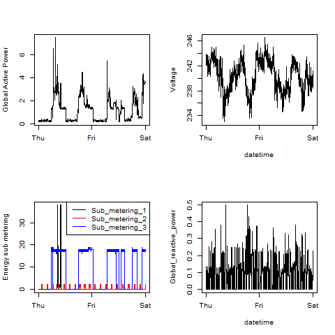

##Instructions

#####[Full project description](https://www.coursera.org/learn/exploratory-data-analysis/peer/ylVFo/course-project-1)

This assignment uses data from the [UC Irvine Machine Learning Repository](http://archive.ics.uci.edu/ml/), a popular repository for machine learning datasets. In particular, we will be using the “Individual household electric power consumption Data Set” which I have made available on the course web site:

**Dataset**: [Electric power consumption](https://d396qusza40orc.cloudfront.net/exdata%2Fdata%2Fhousehold_power_consumption.zip) [20Mb]

**Description**: Measurements of electric power consumption in one household with a one-minute sampling rate over a period of almost 4 years. Different electrical quantities and some sub-metering values are available.
The following descriptions of the 9 variables in the dataset are taken from the UCI web site:

- **Date**: Date in format _dd/mm/yyyy_
- **Time**: time in format _hh:mm:ss_
- **Global_active_power**: household global minute-averaged active power (in kilowatt)
- **Global_reactive_power**: household global minute-averaged reactive power (in kilowatt)
- **Voltage**: minute-averaged voltage (in volt)
- **Global_intensity**: household global minute-averaged current intensity (in ampere)
- **Sub_metering_1**: energy sub-metering No. 1 (in watt-hour of active energy). It corresponds to the kitchen, containing mainly a dishwasher, an oven and a microwave (hot plates are not electric but gas powered).
- **Sub_metering_2**: energy sub-metering No. 2 (in watt-hour of active energy). It corresponds to the laundry room, containing a washing-machine, a tumble-drier, a refrigerator and a light.
- **Sub_metering_3**: energy sub-metering No. 3 (in watt-hour of active energy). It corresponds to an electric water-heater and an air-conditioner.

**Steps**:

1. For plotting I used only data from the dates 2007-02-01 and
2007-02-02.
2. Date and Time variables converted to Date/Time classes in R using the `strptime()` and `as.Date()`
functions.
   * Note that in this dataset missing values are coded as `?`.

3. "**get_data.R**" downloads data set, subsets needed days, converts Date and Time variables.
4. "**plot1.R**" - "**plot4.R**" scripts checks
    * if data is available in the R Environment. 
         * If not - runs _get_data()_ function from "_get_data.R_" script
    * and plots into PNG file according graphs:

####_plot1_:

####_plot2_:

####_plot3_:

####_plot4_:
